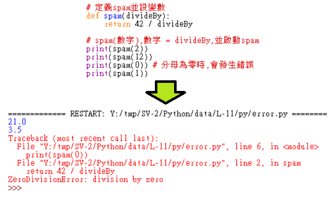

Title: 第11課 - Error Hamdling
Date: 2017-08-11 20:06
Category: Python
Tags: notes, Lesson 11
Slug: Lesson 11
Author: 40423222

參考資訊:
網站: <a href="https://automatetheboringstuff.com/chapter3/">https://automatetheboringstuff.com/chapter3/</a>
影片: <a href="https://www.youtube.com/watch?v=qS0UkqaYmfU&feature">https://www.youtube.com/watch?v=qS0UkqaYmfU&feature</a>

<!-- PELICAN_END_SUMMARY -->

<!-- 發生Error時,如何解決 -->
### 說明:
Error Hamdling
<ul>
<li>try:
<ul>
<li>說明: 將會檢查在try內的內容,如果檢查到錯誤,將啟動except
</ul>
<li>except:
<ul>
<li>說明: 放入發生錯誤時,要執行的指令
<ul>
<li>可以設定要執行的錯誤種類
<pre>例:    except NameError: 指定NameError的錯誤,執行這指令</pre>
<li>以下還有:
<ul>
<li>ZeroDivisionError(分母為零)
<ul>
<li>例: 10/0(分母為零)
</ul>
<li>NameError(變數沒定義)
<ul>
<li>例: 10 / maber(maber沒定義)
</ul>

### error:

### try except:

### try except-2:

### try except-3:
