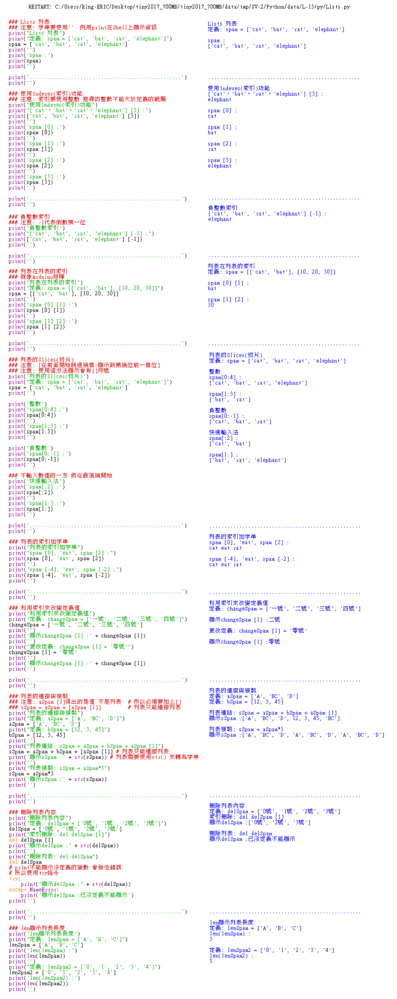

Title: 第13課 - Lists 列表
Date: 2017-09-07 22:53
Category: Python
Tags: notes, Lesson 13
Slug: Lesson 13
Author: 40423222

關於列表功用的介紹 
參考資訊:
網站: <a href="https://automatetheboringstuff.com/chapter3/">https://automatetheboringstuff.com/chapter3/</a>
影片: <a href="https://www.youtube.com/watch?v=48WXHT0dfEY">https://www.youtube.com/watch?v=48WXHT0dfEY</a>

<!-- PELICAN_END_SUMMARY -->

<!-- 關於列表功用的介紹 -->
### 說明:
Lists 列表
<ul>
<li>name [0號, 1號, 2號] 就像Arduino的矩陣
<ul>
<li>注意: 第一位以0這數字來表示
<li><pre>例如對Shell輸入:    >>> spam = ['cat', 'bat', 'rat', 'elephant']    >>> spam    ['cat', 'bat', 'rat', 'elephant']
</ul>
<li>更多功能在下方圖片介紹
</ul>

<!-- 因為圖片字太小所以要更改平時的圖片格式,需要改回來 可以去參考第11課 -->
### Lists 列表的用法:

### 資料自動製成列表:
