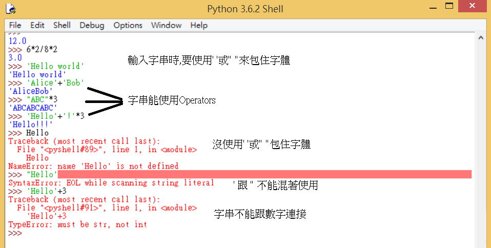
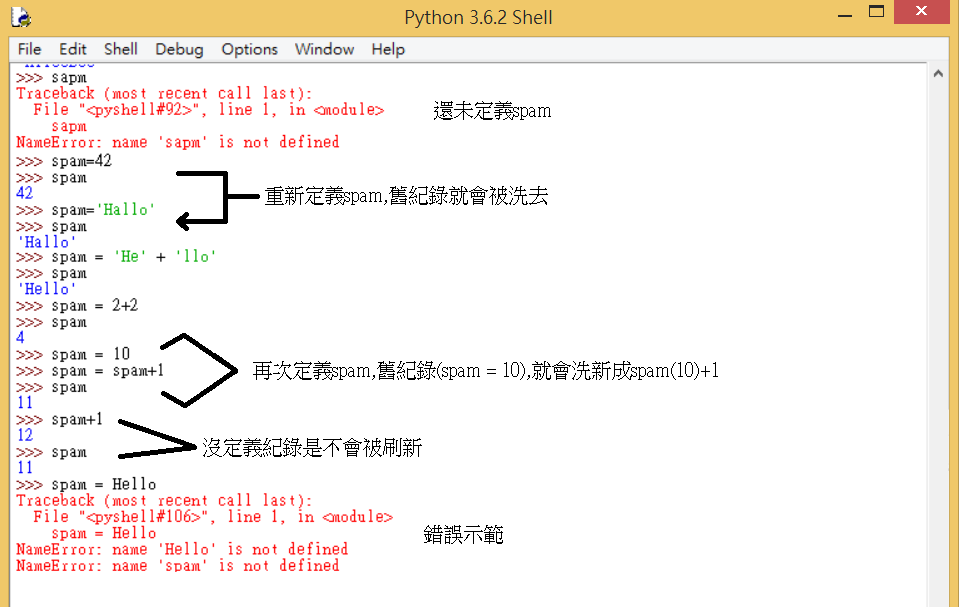

Title: 第2課 - 表達式，數據類型和變量
Date: 2017-07-24 13:00
Category: Python
Tags: notes, Lesson 2
Slug: Lesson 2
Author: 40423222

參考資訊:
網站: <a href="https://automatetheboringstuff.com/chapter1/">https://automatetheboringstuff.com/chapter1/</a>
影片: <a href="https://www.youtube.com/watch?v=7qHMXu99d88">https://www.youtube.com/watch?v=7qHMXu99d88</a>

<!-- PELICAN_END_SUMMARY -->

### 第一步:
在開始使用Python前,先<a href="https://www.python.org/">點這</a>免費下載Python

### 開啟IDLE:
點擊電腦左下角,就會有收尋功能,輸入Python就可以找到IDLE

### Expression(顯示) = Values(值) + Operators(運算符號)

### Order of Operations(執行順序)
1.Parentheses(括號)
 
2.Multiplication(乘) / Division(除)
 
3.Addition(加) / Subtraction(減)

### Data Types(數據類型):
#### integers "ints"(整數)
Ex: 1 or 2 or 3
####Floating point "floats"(浮點數)
Ex: 0.123 or 1.321
 
說明: 主要差別,有小數點(floats)跟沒小數點(ints)

### String Concatenation(字串連接):

### Variables(變數):
Assignment Statement: spam=42　說明: 輸入spam將會顯示42

### Recap(複習):
IDLE is an editor
 
Interactice Shell (>>>) & File Editor
 
Int, Float, String
 
'Hello World'
 
spam = 42
 
spam + 1