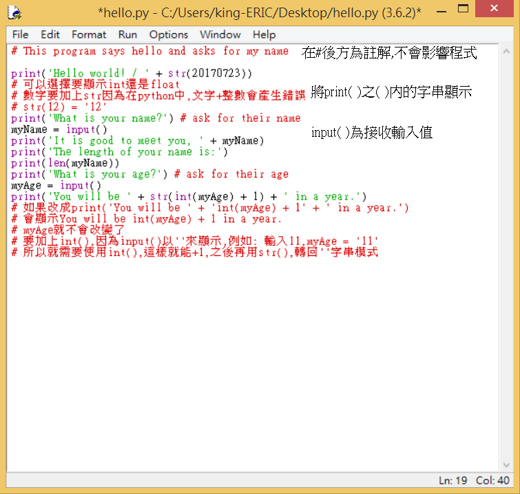
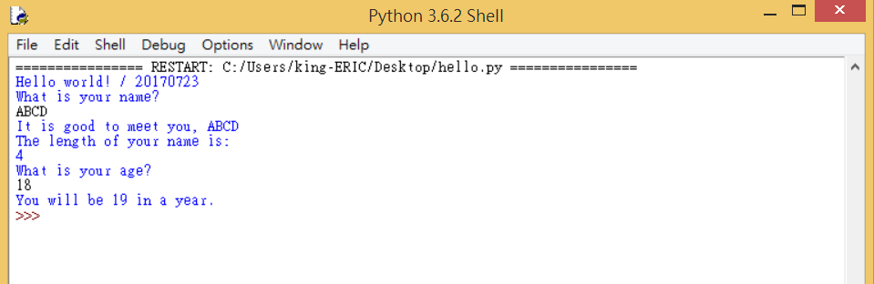

Title: 第3課 - 你的第一個程式
Date: 2017-07-25 02:25
Category: Python
Tags: notes, Lesson 3
Slug: Lesson 3
Author: 40423222

參考資訊:
網站: <a href="https://automatetheboringstuff.com/chapter1/">https://automatetheboringstuff.com/chapter1/</a>
影片: <a href="https://www.youtube.com/watch?v=buMTH6ICnqkhttps://www.youtube.com/watch?v=buMTH6ICnqk">https://www.youtube.com/watch?v=buMTH6ICnqk</a>

<!-- PELICAN_END_SUMMARY -->

### writing Our first program(寫出我們第一個程式):
開起New File
 

### 建立程式:
建立完成,Save後,點擊Run/Run Moodule,來啟動程式
 

### 執行程式:
黑色字體,是使用者要輸入的資訊.
如圖,ABCD和18
 

 
執行完就會自跳出程式

### print( ):
輸入在( )內的字串,會顯示在Shell

### input( ):

### int( ) and str( ):
int( ): 將有字串的數字轉為整數,例如: int('123') = 123,而不是'123',int(12.123) = 12,int(12.123+1) = 13
 
str( ): 將沒有字串的數字轉為字串,例如: str(123) = '123',而不是123

### len( ):
顯示有幾個字串,例如: len('123Abc') = 6
 
