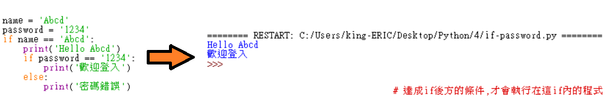
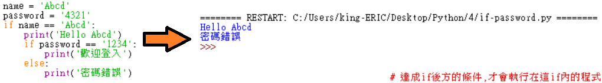
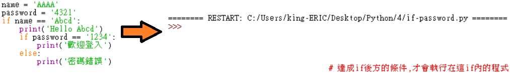

Title: 第4課 - 比較跟布林運算符號
Date: 2017-07-26 16:26
Category: Python
Tags: notes, Lesson 4
Slug: Lesson 4
Author: 40423222

參考資訊:
網站: <a href="https://automatetheboringstuff.com/chapter2/">https://automatetheboringstuff.com/chapter2/</a>
影片: <a href="https://www.youtube.com/watch?v=4XA9CKJJbr4&feature=youtu.be">https://www.youtube.com/watch?v=4XA9CKJJbr4&feature=youtu.be</a>

<!-- PELICAN_END_SUMMARY -->

### Comparison Operators(比較運算符號):
<table border="5" width="100%" align="center">
<tr>
<td  style="text-align:center" bgcolor='#FFD78C' colspan="7">Comparison Operators(比對運算符號)</td>
<tr>
<td style="text-align:center" bgcolor='#FFD78C'>Operators</td>
<td style="text-align:center" >==</td>
<td style="text-align:center" >!=</td>
<td style="text-align:center" ><</td>
<td style="text-align:center" >></td>
<td style="text-align:center" ><=</td>
<td style="text-align:center" >>=</td>
<tr>
<td style="text-align:center" bgcolor='#FFD78C'>功能</td>
<td style="text-align:center">相等</td>
<td style="text-align:center">不相等</td>
<td style="text-align:center">小於</td>
<td style="text-align:center">大於</td>
<td style="text-align:center">小於並相等</td>
<td style="text-align:center">大於並相等</td>
</table>
 

### Boolean Operators(布林運算符號):
<table border="5" width="100%" align="center">
<tr>
<td  style="text-align:center" bgcolor='#FFD78C' colspan="4">Boolean Operators(布林運算符號)</td>
<tr>
<td style="text-align:center" bgcolor='#FFD78C' width="100">Operators</td>
<td style="text-align:center">and</td>
<td style="text-align:center">or</td>
<td style="text-align:center">not</td>
</table>
 

### if:
帳密在於程式碼內,所以只能在編輯程式碼時才能變更

 

 

### if-改:
可以在Shell介面輸入帳密　註解:帳號可以隨便取,密碼一定要輸入正確 
