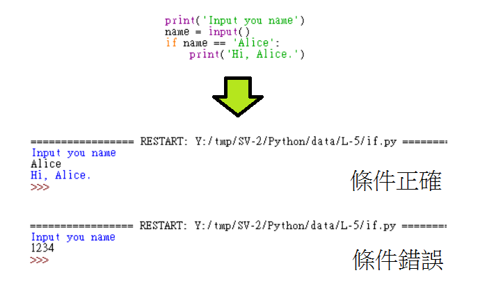
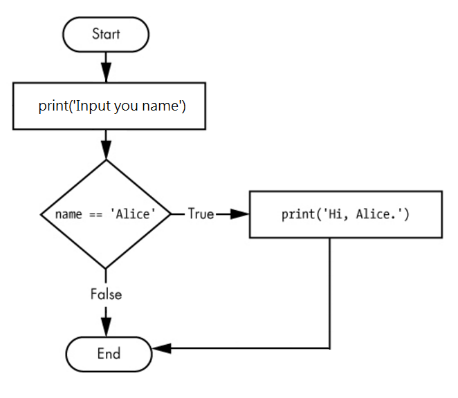
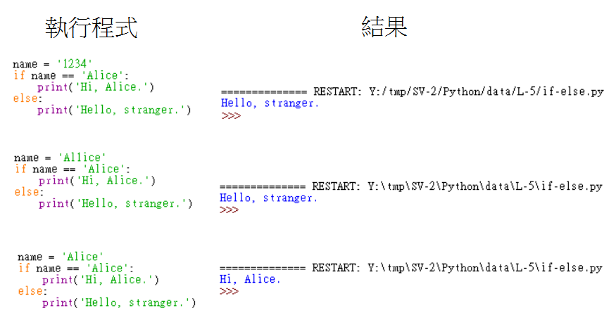
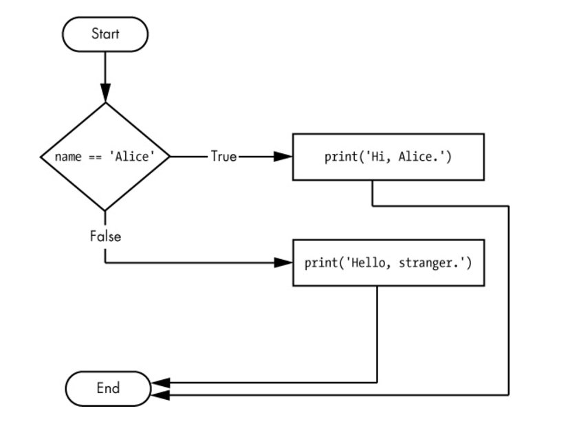
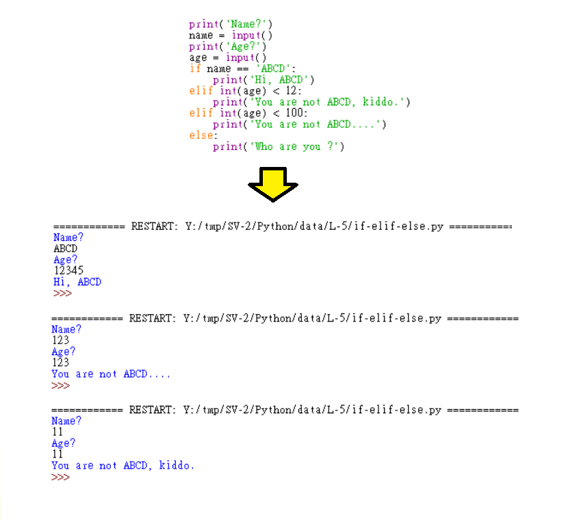
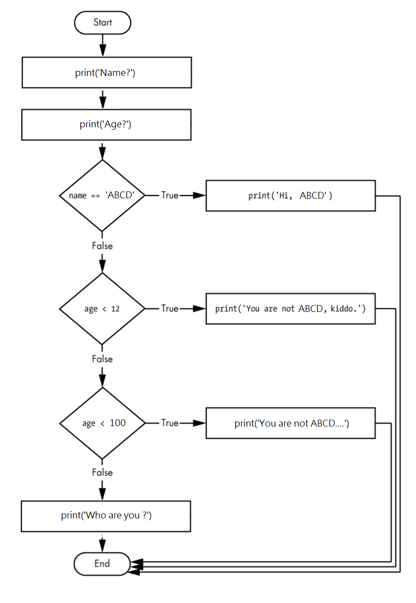

Title: 第5課 - if, elif, and else 條件指令
Date: 2017-07-29 23:07
Category: Python
Tags: notes, Lesson 5
Slug: Lesson 5
Author: 40423222

參考資訊:
網站: <a href="https://automatetheboringstuff.com/chapter2/">https://automatetheboringstuff.com/chapter2/</a>
影片: <a href="https://www.youtube.com/watch?v=lWeCgEbk-Ro&feature=youtu.be">https://www.youtube.com/watch?v=lWeCgEbk-Ro&feature=youtu.be</a>

<!-- PELICAN_END_SUMMARY -->
<body background="./../data/L-5/img/木板.png">

### 說明:
if (變數 符號 條件): 沒迴圈,單純的判斷
 
if 起始頭,符合條件執行
 
elif 要設定條件,放在開頭以後(放置在if後方,else前方)
 
else 到這直接執行,不需要條件(放置在尾端)
 
注意: 符合條件,就會接結束if

### if:

 

### if-else:

 

### if-elif-else:

 
