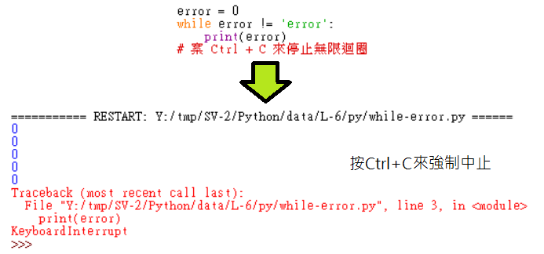
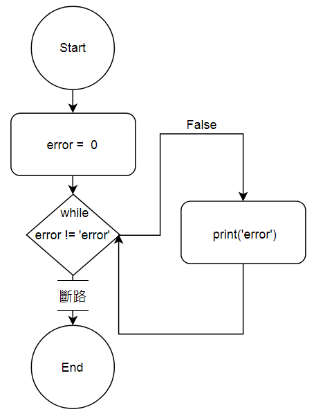
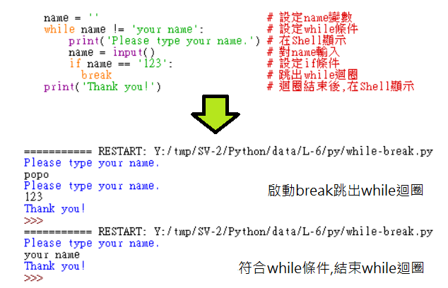
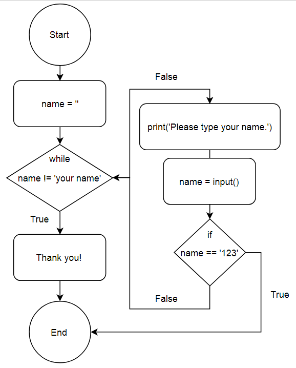
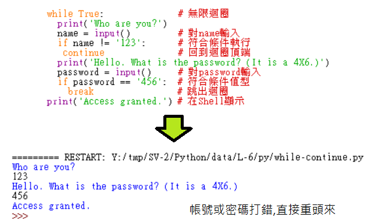
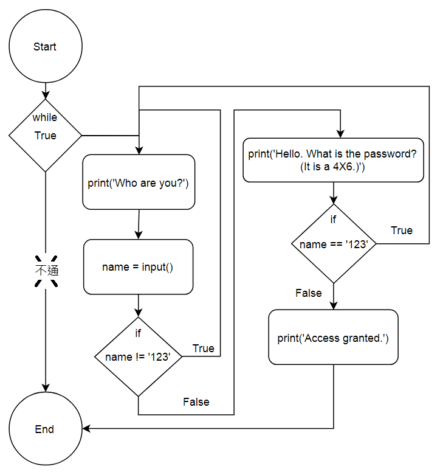

Title: 第6課 - While Loops, break, and continue 迴圈指令
Date: 2017-07-31 14:16
Category: Python
Tags: notes, Lesson 6
Slug: Lesson 6
Author: 40423222

參考資訊:
網站: <a href="https://automatetheboringstuff.com/chapter2/">https://automatetheboringstuff.com/chapter2/</a>
影片: <a href="https://www.youtube.com/watch?v=885qKiiKisI&feature=youtu.be">https://www.youtube.com/watch?v=885qKiiKisI&feature=youtu.be</a>

<!-- PELICAN_END_SUMMARY -->

### 說明:
while (變數 符號 條件): 有迴圈(就像Arduino的for迴圈)
注意: 符合條件就會跳出迴圈(不符合條件才會執行)

### while-variable + 1:

 

### while-0 to 10-else:

 

### while-error:

 

### while-break:

 

### while-not stop:

 

### while-continue:

 
