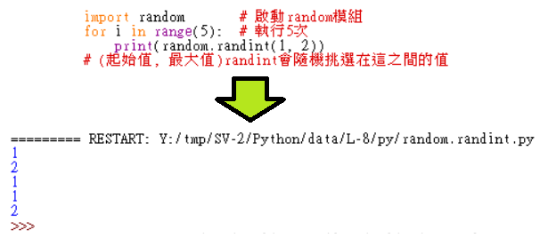

Title: 第8課 - import, sys.exit( ), random.randint( )
Date: 2017-08-05 07:13
Category: Python
Tags: notes, Lesson 8
Slug: Lesson 8
Author: 40423222

參考資訊:
網站: <a href="https://automatetheboringstuff.com/chapter2/">https://automatetheboringstuff.com/chapter2/</a>
影片: <a href="https://www.youtube.com/watch?v=xJLj6fWfw6k&feature=youtu.be">https://www.youtube.com/watch?v=xJLj6fWfw6k&feature=youtu.be</a>

<!-- PELICAN_END_SUMMARY -->

### 說明:
import, random and sys
<ul>
<li>import:
啟動模組
<ul>
<li>random模組
<ul>
<li>random.randint(起始值, 最大值):
範圍亂數
</ul>
<li>sys模組
<ul>
<li>sys.exit( ):
強制退出</li>
</ul>

### random.randint:

### sys.exit:
