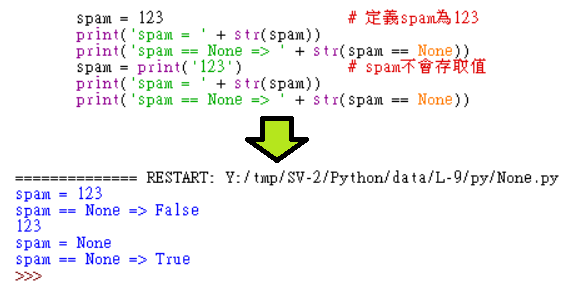
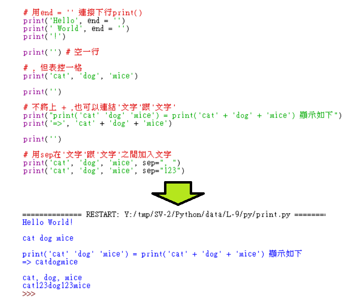

Title: 第9課 - def and print( )
Date: 2017-08-07 16:07
Category: Python
Tags: notes, Lesson 9
Slug: Lesson 9
Author: 40423222

參考資訊:
網站: <a href="https://automatetheboringstuff.com/chapter3/">https://automatetheboringstuff.com/chapter3/</a>
影片: <a href="https://www.youtube.com/watch?v=WB4hJJkfhLU&feature=youtu.be">https://www.youtube.com/watch?v=WB4hJJkfhLU&feature=youtu.be</a>

<!-- PELICAN_END_SUMMARY -->

### 說明:
def and print( )
<ul>
<li>主要內容:
<ul>
<li>def: 定義變數為程式
<li>更詳細說明print( )
</ul>

### def hello():

### def hello(name):

### def plus random:

### None:

### print:
